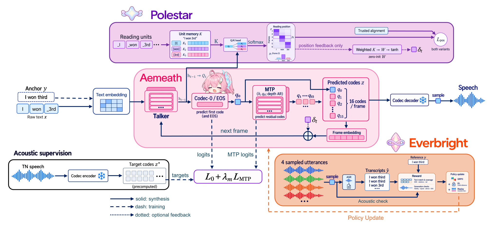
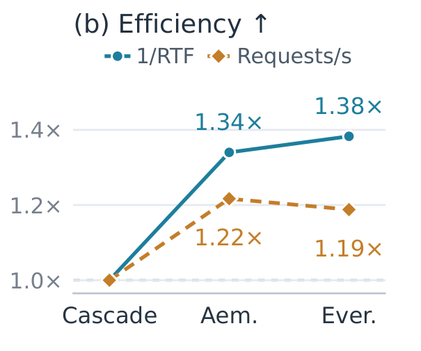

<div align="center">


# Aemeath-TTS

**Can One Model Normalize and Speak?**<br>
Normalization-Aware Modeling for End-to-End Speech Synthesis

Jiecheng Liao<sup>1,2</sup>, Jialun Wu<sup>1</sup>, Zhebo Wang<sup>1,3</sup>, Jiawang Liu<sup>1</sup>, Chen Ye<sup>1</sup>, Guanjun Jiang<sup>1</sup>

<sup>1</sup>阿里巴巴千问事业部 · <sup>2</sup>香港科技大学 · <sup>3</sup>浙江大学

**[🎧 在线试听](https://ffftuanxxx.github.io/Aemeath-TTS/)** · **[实验结果](#实验结果)** · **[开源进度](#开源进度)**

[English](README.md) | 简体中文

</div>

## 项目简介

**Aemeath-TTS** 基于 Qwen3-TTS-1.7B，直接将原始文本转换为语音，无需外置文本归一化模型。面向数字、日期、单位、Markdown 和中英混合内容，同时改善读法准确性与朗读完整性。

- **Aemeath — 学会怎么读。** 让原始文本与归一化文本锚点共享声学目标，联合微调 Talker 和 MTP。
- **Everbright — 把内容读完整。** 通过覆盖感知 GRPO 联合优化 16 个码本和 EOS，惩罚漏读、重复、过长静音与未正常结束。
- **Polestar — 学会读到哪里。** 引入声学帧到文本阅读单元的位置监督，并探索可选的位置反馈；效果最好的变体仅在训练时使用位置监督。

<p align="center">
  
</p>

*论文方法总览。ASR、对齐与损失分支仅用于训练。*

## 实验结果

**Aemeath-TNBench 朗读准确率。** 基准包含约 1 万条人工标注的混合格式文本，支持多种合理读法。CER 基于非流式输出计算；各模型仅排除不支持的输入，实际计分样本数为 9,424–9,465。

| 模型 | TN 前端 | CER (%) ↓ |
| :--- | :--- | ---: |
| TN-LLM → Qwen3-TTS Base | 学习式 LLM | 1.314 |
| IndexTTS2 | 关闭 | 23.667 |
| IndexTTS2 | 原生规则 | 10.644 |
| CosyVoice3 | 关闭 | 8.590 |
| VoxCPM2 | 关闭 | 11.266 |
| FireRedTTS3 | WeText | 5.163 |
| XTTS-v2 | 原生前端 | 10.552 |
| Qwen3-TTS Base | 关闭 | 6.398 |
| Aemeath | 无 | 4.293 |
| Aemeath + Everbright | 无 | 3.379 |
| + Polestar（position-feedback） | 无 | 3.591 |
| **+ Polestar（position-only）** | **无** | **3.315** |

**批量推理效率。** Batch size 为 16，以学习式 TN 级联方案为 1×，比较 RTF 的倒数与请求吞吐量，均为越高越好。

<p align="center">
  
</p>

## Demo 与开源进度

[在线 Demo](https://ffftuanxxx.github.io/Aemeath-TTS/#listening) 提供 **20 条精选样例、180 段音频**，涵盖系统对比与阶段消融。精选样例用于辅助理解上方基准结果；选例方式与本地试听方法见[试听说明](docs/listening_zh.md)。

<a id="开源进度"></a>

- [x] 在线试听与样例元数据
- [ ] 训练和推理代码
- [ ] 模型权重与完整 Aemeath-TNBench

完整项目正在整理中，当前仓库提供试听 Demo。

<details>
<summary>引用</summary>

```bibtex
@misc{liao2026aemeathtts,
  title  = {Aemeath-TTS: Can One Model Normalize and Speak? Normalization-Aware Modeling for End-to-End Speech Synthesis},
  author = {Jiecheng Liao and Jialun Wu and Zhebo Wang and Jiawang Liu and Chen Ye and Guanjun Jiang},
  year   = {2026},
  url    = {https://github.com/ffftuanxxx/Aemeath-TTS}
}
```

</details>

本项目基于 [Qwen3-TTS](https://github.com/QwenLM/Qwen3-TTS)。
